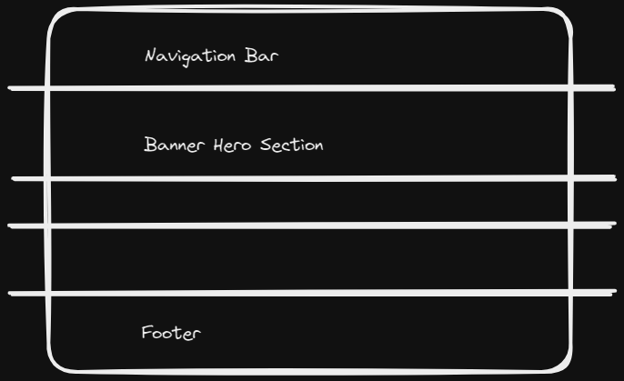

# Notes

## Digital Playground

This is an experiment, to learn and have fun with Svelte, but also, get the website up and running.

## Design on the go

Things might break. As the svelte community and Rich puts it; here be Dragons.

---

## Latest Updates 

- Will use the latest packages.
    - This might induce the breaking, and things would break often.

- Am learning ThreeJs and Threlte simultaneously

- Storybook for UI components
    - This is for learning how to use storybook and maybe not over complexify the project as such. But yeah, think about modualr and compnent based developemtn.

- Skeleton UI based on Tailwind based on PostCSS
    - This is what I am thinking. Skeleton or Daisy. Will think abou twhich one to use. I love teh gradients and stuff of skeleton, but I definitly could do away woth redundatn class names. Let me give dasiy a try. Also, I need to follow process I think!
    
- CMS would be required.
    - But for now, I guess I would use a data store adn stroe files in the fs. Maybe later on I can think about prismic or other data stores and dbs? 

- database . if reqd., maybe use vercel?
    - and so many other. Supabase and all. Check

- 10th July
    - Got the Website working [here](https://rdtect.xyz). It is hosted with Vercel. And I now have to figure out about subdomains.
    - Writing content. Such a task!!
    - 